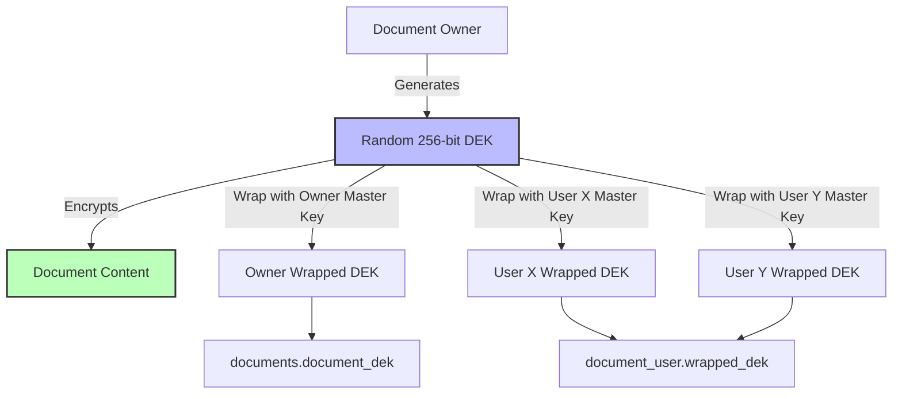

# Envelope-Based Document Sharing Implementation Plan

## Overview
This plan describes how to implement the envelope encryption / multi-user DEK wrapping system as specified in `.md/fix,suggestions.md` for the existing StegoLock codebase.

---

## Architecture



---

## Implementation Steps

### Phase 1: Database & Model Updates

1. **Migration File**
   - File: `database/migrations/2026_04_23_000000_add_envelope_encryption_fields.php`
   - Add to `documents` table:
     - `encryption_mode` enum('legacy_derived', 'envelope_wrapped') default 'legacy_derived'
     - `document_dek` binary nullable
     - `document_dek_iv` binary nullable
     - `document_dek_tag` binary nullable
   - Add to `document_user` pivot table:
     - `wrapped_dek` binary nullable
     - `wrapped_dek_iv` binary nullable
     - `wrapped_dek_auth_tag` binary nullable

2. **Document Model Updates**
   - Add `encryption_mode`, `document_dek`, `document_dek_iv`, `document_dek_tag` to `$fillable`
   - Add method `isEnvelopeMode(): bool`
   - Add method `getDEKForUser(User $user)`

---

### Phase 2: Cryptography Implementation

3. **EncryptionService Enhancement**
   - Extend existing `app/Providers/EncryptionService.php`:
     ```php
     // New methods
     generateRandomDEK(): string
     wrapDEK(string $dek, string $userMasterKey): array
     unwrapDEK(string $wrappedDek, string $iv, string $authTag, string $userMasterKey): string
     ```
   - Maintain full backward compatibility with existing legacy encryption

4. **Dual Mode Encryption Support**
   - Update `encrypt()` method to accept `$encryptionMode` parameter
   - Detect mode automatically in `decrypt()` method
   - Branch execution path based on mode

---

### Phase 3: Backend Logic

5. **Upload Workflow**
   - Add `encryption_mode` parameter to document upload endpoint
   - When envelope mode is selected:
     - Generate true random DEK
     - Encrypt document with this DEK
     - Wrap DEK for document owner
     - Store wrapped DEK on document record
     - Wrap DEK for every selected viewer user
     - Store individual wrapped DEKs in pivot table

6. **Decryption Workflow**
   - On document access:
     - Check encryption mode
     - For envelope mode:
       - Locate wrapped DEK for current user (from pivot table)
       - Unwrap DEK using current user's master key
       - Decrypt document with unwrapped DEK
     - For legacy mode: maintain existing HKDF derivation

7. **Sharing Logic**
   - Update share endpoint:
     - When sharing existing envelope document:
       - Retrieve plain DEK from owner context
       - Wrap DEK for new user
       - Store in document_user pivot
     - When sharing legacy document:
       - Keep as read-only warning or prompt to re-encode

8. **Revocation Logic**
   - On grant revocation:
     - Delete user's wrapped DEK from pivot table
     - DEK remains secure, user loses access immediately

---

### Phase 4: Frontend Updates

9. **Upload Modal**
   - Add dropdown selector for encryption mode
   - Conditionally show user selection list when envelope mode is selected
   - Show security implications for each mode

10. **Share Modal**
    - Indicate if document supports secure sharing
    - Show sharing status for envelope documents
    - Add revoke access button

11. **Document View Page**
    - Show document access type
    - Show who has access to the document
    - Handle gracefully when user no longer has valid grant

---

### Phase 5: Testing & Validation

12. **Unit Tests**
    - `tests/Unit/EncryptionServiceEnvelopeTest.php`
    - Test DEK generation
    - Test wrapping / unwrapping round trip
    - Test tamper detection

13. **Feature Tests**
    - `tests/Feature/EnvelopeSharingTest.php`
    - Full upload -> share -> decode workflow
    - Test revocation
    - Test multi-user access

14. **Backward Compatibility Tests**
    - Verify existing documents continue to work
    - Verify legacy mode remains default
    - No breaking API changes

---

## Backward Compatibility Guarantees

✅ All existing documents remain 100% functional
✅ Legacy mode remains default for new documents
✅ No data migration required
✅ Existing API endpoints work unchanged
✅ System can run in hybrid mode indefinitely

---

## Security Properties

| Property | Legacy Mode | Envelope Mode |
|---|---|---|
| Owner only access | ✅ | ✅ |
| Share with multiple users | ❌ | ✅ |
| Secure revocation | ❌ | ✅ |
| DEK never stored plaintext | ✅ | ✅ |
| Per-user independent keys | ❌ | ✅ |
| Forward secrecy | ❌ | ✅ |

---

## Final Checklist

Before deployment:
- [ ] All migration fields are correctly nullable
- [ ] Error handling for missing wrapped DEK
- [ ] Master key session handling works for shared users
- [ ] All edge cases are covered in tests
- [ ] Default encryption mode is still legacy
- [ ] Performance impact is acceptable
